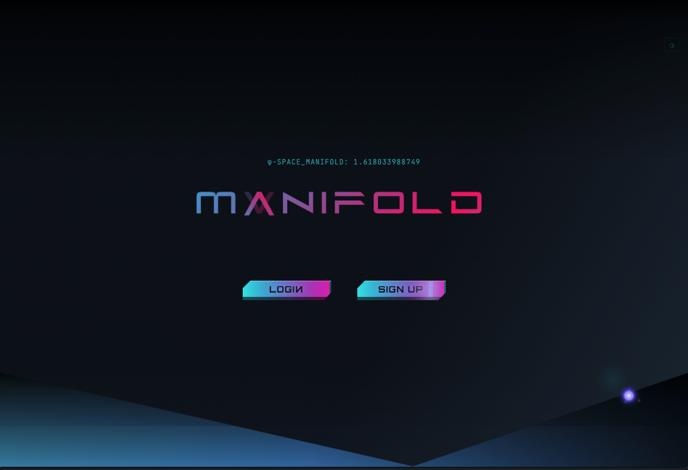
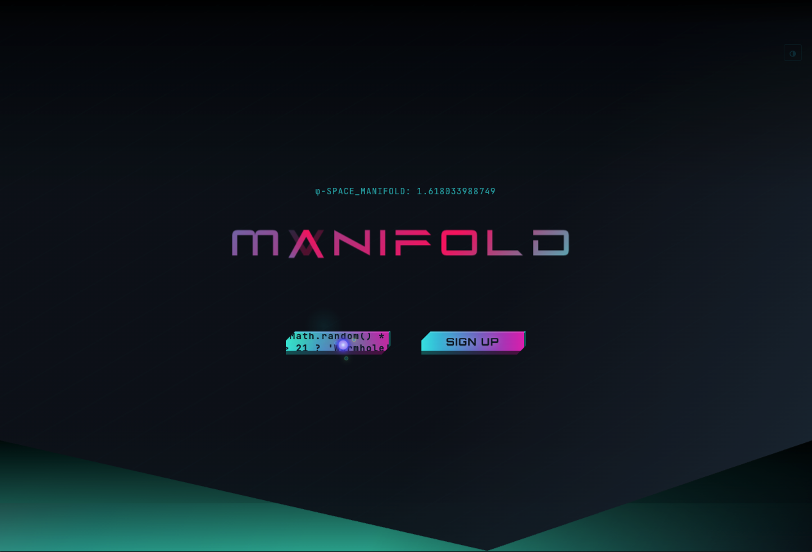
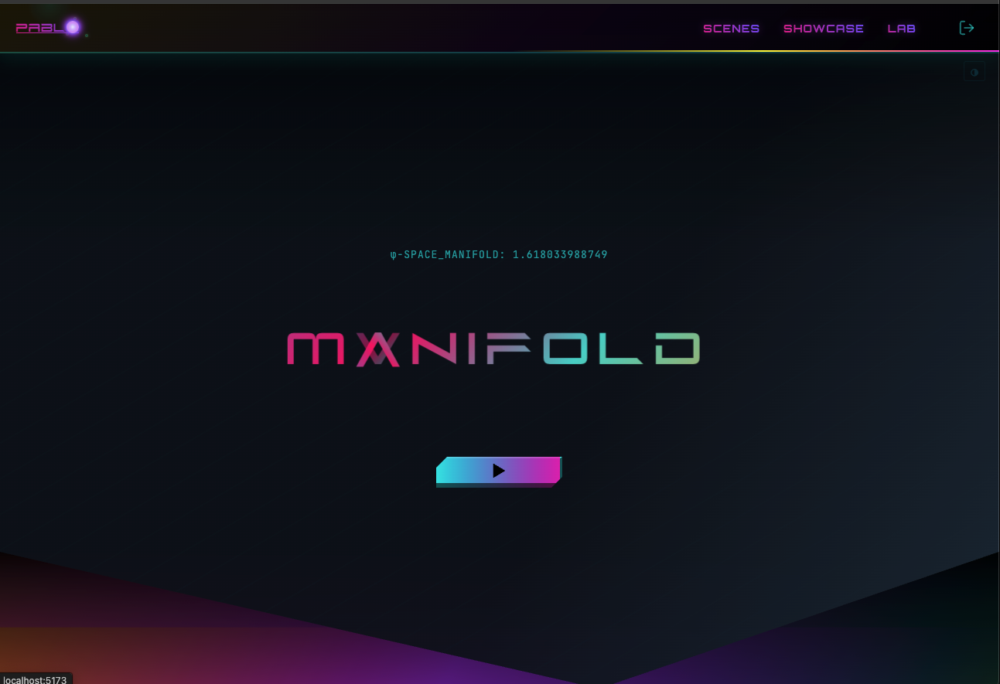
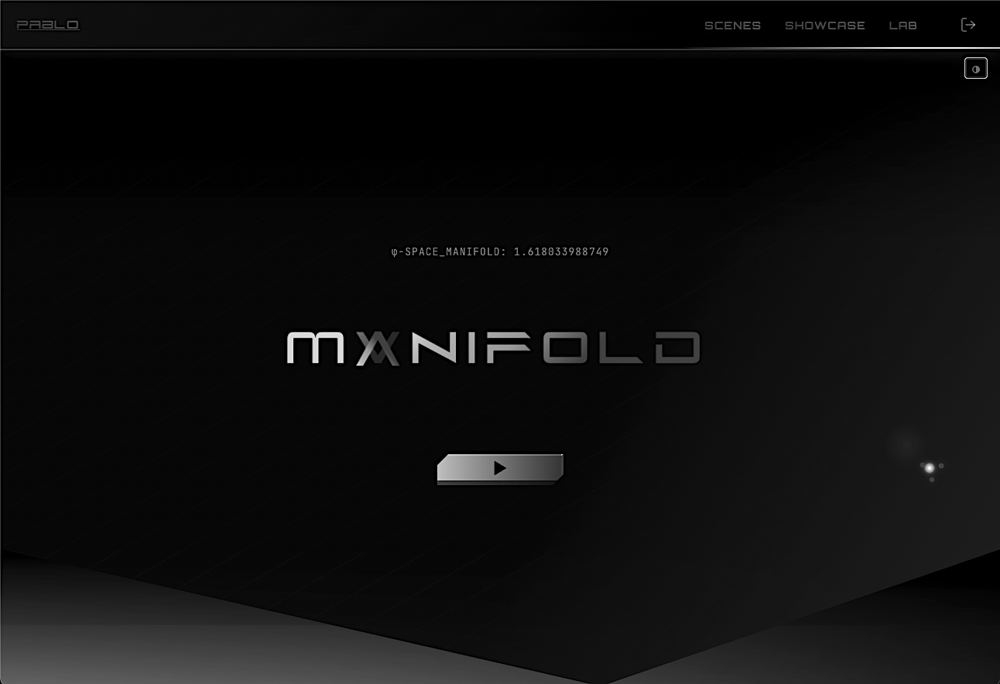

#  Manifold

> Interactive 3D geometry platform with 24 hyperdimensional shapes, progressive character unlocks, and full-stack scene management

---

⚠️ **COPYRIGHT NOTICE** ⚠️

© 2025 Pablo Cordero. All Rights Reserved.

This project is **NOT open source**. You may view the code for personal learning only. Copying, modifying, distributing, or using this code in your own projects is strictly prohibited without explicit written permission. See [LICENSE](./LICENSE) for details.

---

<div align="center">


[🚀 Live Demo](https://manifold-3d.vercel.app) • [📖 Full Documentation](./docs) • [� API Docs](./docs/TECHNICAL_SPECIFICATION.md)

</div>

## 📸 Screenshots

<div align="center">

### Landing Page


_MANIFOLD landing page with sign in / sign up_


_Landing page with interactive enter button_

### Homepage


_Home page with MANIFOLD title and quantum aesthetics_

### Dark Mode


_MANIFOLD interface in dark mode_

### Sign Up Page


_User registration with holographic design_

### Login Page


_Authentication interface with quantum styling_

### Main Geometry Lab Interface


_Quantum manifold with custom hyperframe colors in matrix environment_


_Compound mega-tesseract III showing 4D hyperdimensional structure_

### Character Showcase Gallery


_Progressive unlock system with animated 3D characters_

### Character Viewer - Animated Detail


_Vectra character with holographic spellcast animation and controls_

### Scene Management Dashboard


_Personal scene gallery with save/load functionality_

### Unlock Progression System


_Gamified character and animation unlocks with sound effects_

</div>

---

## 🎨 Design & Plannin

### Database Schema (ERD)


_MongoDB schema showing User, Scene, and unlock relationships_

### Application Wireframes


_UI/UX design and user flow planning_

**Design Process:**

- Planned data relationships before coding (ERD)
- Designed user flows and interactions (wireframes)
- Focused on quantum aesthetic with glassmorphic UI
- Progressive unlock system mapped to scene count thresholds

---

## Overview

**A gamified 4D geometry exploration platform.** Discover hyperdimensional shapes, save configurations you find beautiful, and unlock animated characters through progression. It combines mathematical visualization with game mechanics to make abstract concepts engaging.

Built with React, Three.js, and MongoDB, Manifold lets you explore 24 advanced geometries—from tesseracts to quantum manifolds—customize materials, animations, and lighting, then save your favorite scenes. Each save contributes to unlocking original 3D characters (Nexus Prime, Icarus-X, Vectra), creating a feedback loop that rewards curiosity.

**The concept**: Make 4D geometry *fun* to explore, not just educational. Unlike traditional geometry viewers, this creates an engagement loop—exploration → discovery → saving → unlocks → more exploration.

---

## ✨ What This App Offers Users

### 🎭 Interactive 3D Character Showcase

- View originally created 3D animated characters (Nexus Prime, Icarus-X, Vectra)
- Each character features unique visual effects:
  - **Nexus Prime**: Quantum shockwaves with spectral colors and glitch effects
  - **Icarus-X**: Digital glitch bursts and energy particles
  - **Vectra**: Holographic spellcast effects and radial geometries
- Speed controls let you slow down/speed up animations to appreciate details
- Multiple animation variants per character (unlocked through progression)
- Animation switcher to toggle between character moves

### 🌌 Immersive Visual Experience

- Custom environments for each character (skyboxes, particle effects, dynamic lighting)
- Cursor effects with gravity field and dimensional rifts
- Text scrambling animations (Katakana + code symbols) on interactive elements
- Professional glassmorphic UI design with backdrop filters
- Character-specific color themes and aesthetic palettes
- Responsive design optimized for desktop and mobile

### 💾 Scene Creation & Management

- **Create personalized scenes**: Save any geometry + animation + lighting configuration
- **Gamified progression**: Saving scenes unlocks new characters and animations
- **Personal gallery**: "My Scenes" page to organize and manage your collection
- **Full CRUD operations**: Load, edit, update, or delete your saved scenes

**The Experience**: Explore 4D geometry, discover hidden animations through saving scenes, and curate your own collection of interactive 3D moments—all in a visually stunning quantum-themed interface.

---

## 🎯 Core Features

### 🔧 Interactive Geometry Lab

- **24 Advanced Geometries**: From classical shapes to 4D polytopes and quantum manifolds
- **Real-time Controls**: Material properties (metalness, emissive intensity, wireframe blend)
- **6 Animation Algorithms**: Rotate, Float, Omni-Intellect (5-phase choreography)
- **Dynamic Lighting**: Ambient + directional lights with full 3D positioning
- **Environment System**: Quantum-themed backgrounds with 360° hue shifting
- **Audio Reactive Visuals**:
  - Microphone-driven geometry with real-time FFT (Fast Fourier Transform) analysis
  - Adaptive noise filtering with 55%/50% sensitivity thresholds
  - Frequency-to-geometry mapping:
    - Bass frequencies (20-250 Hz) → X-axis rotation + scale pulsing (only when very loud) + Z-position movement
    - Mid frequencies (250-2000 Hz) → Y/Z-axis rotation
  - **Dynamic Color Cycling**: Mesh and hyperframe change colors independently every 3 full rotations
    - Mesh uses darker complementary palette (based on base color #670d48)
    - Hyperframe uses brighter, vibrant palette for contrast
    - Creates evolving color combinations as components drift out of sync
  - Momentum-based physics with 50% friction for natural deceleration
  - Extensive tuning for responsive feel without jitter
  - Smooth acceleration with sound, natural slowdown when audio stops
  - Web Audio API integration with AudioContext and AnalyserNode
  - Real-time frequency data visualization through geometry transformations

### 🎭 Character Showcase

- **3 Animated Characters**: Icarus-X (Seraph), Vectra (Spellcaster), Nexus-Prime (Warrior)
- **Progressive Unlocks**: Characters unlock as users save scenes (gamification)
- **Multi-Animation System**: Animation switcher appears when multiple animations unlocked
- **FBX Pipeline**: Meshy → Mixamo → Blender → React Three Fiber

### 💾 Scene Management

- **Complete CRUD**: Create, Read, Update, Delete with MongoDB persistence
- **Contextual Save States**: "Save Scene" / "Transmute" / "Save As New" based on context
- **Unsaved Changes Detection**: Navigation blocking prevents accidental data loss
- **Scene Gallery**: User's personal collection with sort/filter options

### 🔐 Authentication & Security

- **JWT-based Security**: bcrypt password hashing, token-based auth
- **Protected Routes**: Scene management requires authentication
- **Session Persistence**: Users stay logged in across browser sessions
- **CORS Configuration**: Secure cross-origin requests
- **Rate Limiting**: API endpoint protection

### 🎨 Interactive UI Features

- **Text Scrambling Effects**: Katakana + code symbol animations on buttons/titles
- **Hover Controls**: Mouse-over geometry selection with real-time preview
- **Ripple Effects**: Material Design click feedback with color variants
- **Quantum Backgrounds**: Interactive color-changing environments
- **Glassmorphic Design**: Modern UI with backdrop filters and transparency
- **Responsive Layout**: Mobile-optimized interface with touch controls

### 🔊 Audio System

- **Unlock Sound Effects**: Audio feedback for character and animation unlocks
- **Sound Validation**: Robust audio system with fallback handling
- **Interactive Feedback**: Audio cues for user actions and achievements

---

## 📊 Key Technical Stats

- **2,700 → 199 lines**: 93% code reduction through custom hooks refactoring
- **21 synchronized state variables**: Real-time 3D manipulation with React state
- **Custom physics**: Transform-based + vertex-deformation animation systems
- **Factory patterns**: Modular wireframe builders for 24 geometry types
- **60fps rendering**: Optimized Three.js animation loop with complex objects

---

## 🚀 Quick Start

### Local Development

```bash
# Clone repository
git clone https://github.com/Cordero080/manifold.git
cd manifold

# Frontend setup
npm install
npm run dev
# Opens http://localhost:5173

# Backend setup (separate terminal)
cd manifold-backend
npm install
cp .env.example .env  # Add your MongoDB URI and JWT secret
npm run dev
# Runs on http://localhost:3000
```

### Deployment

**Frontend** is hosted on GitHub Pages, **Backend** on Render.

```bash
# Deploy to GitHub Pages (from main branch)
npm run build    # Outputs to /docs folder
git add -A && git commit -m "deploy" && git push
# GitHub Pages serves from /docs on main branch
```

**Live URLs:**
- Frontend: https://cordero080.github.io/manifold/
- Backend: https://nexus-geom-lab-backend-sn7k.onrender.com

### Run Tests

```bash
npm test                    # Run all tests once
npm test -- --watch         # Run tests in watch mode
```

---

## 📊 Project Scale

- **336 files** across **119 directories**
- **36,366 lines** of React/Three.js code
- **81 components** with **14 custom hooks**
- **134 state variables** managing real-time interactions
- **7 test suites** with **39 passing tests**

---

### ✅ Test Coverage (Jest)

```bash
Test Suites: 7 passed, 7 total
Tests:       39 passed, 39 total
Time:        0.596 s
```

**Testing Framework:** Jest 30.2.0 with React Testing Library

**Tested Components:**

- Material Factory (geometry creation pipeline)
- ScrambleButton (text animation effects)
- CustomSelect (dropdown UI component)
- Quote (shared UI component)
- Scene Initialization (Three.js setup)
- Controls Handlers (user input logic)
- Quantum Collapse Utility (state transitions)

All tests maintained and passing after code refactoring

````

### Environment Variables

**Frontend `.env`:**

```env
VITE_API_URL=http://localhost:3000/api
````

**Backend `.env`:**

```env
MONGODB_URI=mongodb://localhost:27017/nexus-geom
JWT_SECRET=your-super-secret-key
CLIENT_URL=http://localhost:5173
PORT=3000
```

---

## 📁 Project Structure

```
manifold/
├── 📁 public/
│   ├── 📁 assets/                   # Logo and SVG assets
│   ├── 📁 fonts/                    # Future Z custom typography
│   ├── 📁 models/                   # 3D FBX character files (Icarus, Vectra, Nexus-Prime, etc.)
│   └── 📁 soundEffects/
│       └── unlock.wav               # Audio feedback for unlocks
├── 📁 src/
│   ├── App.jsx                      # Main application component
│   ├── main.jsx                     # React 19.1 entry point
│   ├── index.css                    # Global styles
│   ├── 📁 components/
│   │   ├── 📁 layout/               # App structure (NavBar, etc.)
│   │   ├── 📁 pages/                # Route-level page components
│   │   │   ├── 📁 HomePage/
│   │   │   │   ├── HomePage.jsx
│   │   │   │   ├── HomeIndex.module.scss
│   │   │   │   └── 📁 components/
│   │   │   │       ├── BackgroundLayers.jsx
│   │   │   │       ├── Footer/
│   │   │   │       ├── HeroSection/
│   │   │   │       ├── HessianPolychoronAnimation.jsx
│   │   │   │       ├── ProgressBar.jsx
│   │   │   │       ├── QuantumManifoldAnimation.jsx
│   │   │   │       ├── QuantumNav.jsx
│   │   │   │       ├── QuantumPortal/
│   │   │   │       ├── Scene.jsx
│   │   │   │       └── ScrambleOnHover.jsx
│   │   │   ├── 📁 MyScenesPage/
│   │   │   │   ├── MyScenesPage.jsx
│   │   │   │   ├── MyScenesPage.module.scss
│   │   │   │   ├── MyScenesPage-styles.module.scss
│   │   │   │   └── 📁 components/
│   │   │   │       ├── 📁 SceneCard/
│   │   │   │       │   ├── SceneCard.jsx
│   │   │   │       │   ├── SceneCard.module.scss
│   │   │   │       │   └── index.js
│   │   │   │       └── 📁 QuantumPortalScenes/
│   │   │   │           ├── QuantumPortalScenes.jsx
│   │   │   │           ├── QuantumPortalScenes.module.scss
│   │   │   │           └── index.js
│   │   │   └── 📁 Showcase/
│   │   │       ├── ShowcaseGallery.jsx
│   │   │       ├── ShowcaseGallery.module.scss
│   │   │       ├── 📁 components/
│   │   │       │   ├── 📁 ShowcaseViewer/
│   │   │       │   │   ├── ShowcaseViewer.jsx
│   │   │       │   │   ├── ShowcaseViewer.module.scss
│   │   │       │   │   ├── ShowcaseViewer-styles.module.scss
│   │   │       │   │   ├── index.js
│   │   │       │   │   ├── 📁 RotatingCube/
│   │   │       │   │   ├── 📁 SpeedControl/
│   │   │       │   │   ├── 📁 characters/
│   │   │       │   │   └── 📁 environments/
│   │   │       │   ├── 📁 QuantumPortalShowcase/
│   │   │       │   │   ├── QuantumPortalShowcase.jsx
│   │   │       │   │   ├── QuantumPortalShowcase.module.scss
│   │   │       │   │   └── index.js
│   │   │       │   └── 📁 backgrounds/
│   │   │       │       ├── AnimatedBackground.jsx
│   │   │       │       ├── BackgroundCanvas.jsx
│   │   │       │       ├── BackgroundCanvas.module.scss
│   │   │       │       └── index.js
│   │   │       ├── 📁 data/
│   │   │       │   └── noetechAnima.js
│   │   │       ├── 📁 models/
│   │   │       │   └── FBXModel.jsx
│   │   │       └── 📁 utils/
│   │   │           └── showcaseHelpers.js
│   │   └── 📁 ui/                   # Reusable UI components
│   │       ├── 📁 BeamScanButton/
│   │       ├── 📁 CustomSelect/
│   │       ├── 📁 DeleteSuccessModal/
│   │       ├── 📁 ErrorBoundary/
│   │       ├── 📁 HomeBackground/
│   │       ├── 📁 InvertedLetterText/
│   │       ├── 📁 Quote/
│   │       ├── 📁 ScrambleButton/   # Text animation effects
│   │       ├── 📁 ScrambleLink/
│   │       ├── 📁 SuccessModal/
│   │       └── 📁 Effects/
│   │           ├── 📁 CustomCursor/
│   │           └── 📁 QuantumCursor/
│   ├── 📁 context/
│   │   └── SceneContext.jsx         # 3D scene state management
│   ├── 📁 data/
│   │   └── portalWorlds.js          # Environment configuration data
│   ├── 📁 features/
│   │   ├── 📁 audio/
│   │   │   ├── 📁 components/
│   │   │   │   ├── AudioToggle.jsx          # Audio control UI
│   │   │   │   └── AudioToggle.module.scss  # Styles
│   │   │   └── 📁 hooks/
│   │   │       ├── useAudioAnalyzer.js      # Web Audio API + FFT
│   │   │       └── useAudioReactive.js      # Audio-to-3D mapping
│   │   ├── 📁 auth/
│   │   │   ├── 📁 context/
│   │   │   │   └── AuthContext.jsx          # JWT authentication
│   │   │   └── 📁 services/
│   │   │       └── authApi.js               # Auth API integration
│   │   └── 📁 sceneControls/
│   │       ├── ThreeScene.jsx               # Main 3D renderer
│   │       ├── ThreeScene.css
│   │       ├── controls.css
│   │       ├── 📁 animation/                # Animation systems
│   │       ├── 📁 core/
│   │       │   ├── environmentSetup.js
│   │       │   ├── lightingSetup.js
│   │       │   └── sceneSetup.js
│   │       ├── 📁 geometries/               # Geometry factory patterns
│   │       ├── 📁 hooks/                    # Scene-specific hooks
│   │       │   ├── useSceneInitialization.js
│   │       │   ├── useLightingUpdates.js
│   │       │   ├── useObjectManager.js
│   │       │   ├── useMaterialUpdates.js
│   │       │   ├── useAnimationLoop.js
│   │       │   ├── useCameraController.js
│   │       │   └── useNebulaParticles.js
│   │       ├── 📁 objects/
│   │       │   ├── geometryCreation.js
│   │       │   └── spectralOrbs.js
│   │       └── 📁 utils/                    # Scene utilities
│   ├── 📁 hooks/
│   │   ├── useParallax.js                   # Scroll parallax effects
│   │   ├── useQuantumState.js               # Quantum state management
│   │   └── useSceneState.js                 # Scene state hooks
│   ├── 📁 services/
│   │   └── sceneApi.jsx                     # Scene CRUD API
│   ├── 📁 styles/
│   │   ├── homepage.scss                    # HomePage styles
│   │   ├── titles.scss                      # Title animations
│   │   ├── 📁 components/                   # Component-specific styles
│   │   ├── 📁 core/                         # Core style system
│   │   ├── 📁 layout/                       # Layout styles
│   │   ├── 📁 shared/                       # Shared SCSS modules
│   │   ├── shared.module.scss
│   │   ├── quantumBackground.css
│   │   └── quantumTitles.css
│   └── 📁 utils/
│       ├── coreHelpers.js
│       ├── geometryHelpers.js               # 3D math utilities
│       ├── portalWorlds.js                  # Portal world configs
│       ├── quantumCollapse.js               # Quantum collapse utility
│       ├── textScrambler.js                 # Code symbol effects
│       ├── textScrambler.jsx                # Katakana effects
│       └── threeConstants.js                # Three.js config
├── 📁 manifold-backend/                     # Express.js REST API
│   ├── index.js                             # Server entry
│   ├── 📁 config/
│   │   └── db.js                            # MongoDB connection
│   ├── 📁 middleware/
│   │   └── auth.js                          # JWT verification
│   ├── 📁 models/
│   │   ├── User.js                          # User schema
│   │   └── Scene.js                         # Scene schema
│   ├── 📁 routes/
│   │   ├── auth.js                          # Auth endpoints
│   │   └── scenes.js                        # Scene CRUD
│   ├── resetDevUser.js                      # Dev utility
│   └── package.json
├── 📁 docs/                                 # Technical documentation
│   ├── ARCHITECTURE_DIAGRAM.md
│   ├── INTERACTIVE_SYSTEMS.md
│   ├── TESTING_GUIDE.md
│   ├── 📁 hooks-customHooks/
│   │   ├── CUSTOM_HOOKS_GUIDE.md
│   │   └── HOOKS_INVENTORY.md
│   ├── 📁 refactoring/                      # Refactoring notes
│   └── 📁 study-plan/                       # Learning documentation
├── 📁 screenshots/                          # UI screenshots
├── index.html
├── vite.config.js
└── package.json                             # React 19.1 + Three.js 0.180
```

---

## 🏗️ Architecture Highlights

### Props Consolidation Pattern

Refactored from massive props drilling to clean object-based API:

**Before:** 42 individual props (21 values + 21 setters)
```jsx
<Controls
  scale={scale}
  onScaleChange={setScale}
  metalness={metalness}
  onMetalnessChange={setMetalness}
  // ... 38 more props
/>
```

**After:** 2 object props
```jsx
<Controls 
  config={sceneConfig}
  onChange={{ setScale, setMetalness, /* ... */ }}
/>
```

**Benefits:**
- 70% reduction in JSX code (~100 lines → ~30 lines)
- Easier to extend - add new config in one place
- Type-safe ready for TypeScript interfaces
- Cleaner component APIs

### Custom Hooks System

Refactored monolithic 2,700-line component into modular architecture:

- `useSceneInitialization` - Scene, camera, renderer setup
- `useObjectManager` - Geometry creation and updates
- `useMaterialUpdates` - Real-time material property changes
- `useLightingUpdates` - Dynamic lighting control
- `useAnimationLoop` - 60fps animation orchestration
- `useSceneState` - Centralized scene state management

### Advanced Wireframe System

Multi-component 3D objects with synchronized movement:

- **Solid Mesh**: Primary geometry with PBR materials
- **Thick Wireframes**: Cylinder-based edges (not thin lines)
- **Inner Structures**: Geometry-specific patterns (spirals, hyperframes)
- **Connecting Rods**: Dynamic links between inner/outer structures

### Progressive Unlock Logic

```javascript
Scene 1 → Unlock Icarus-X (Solar Ascension)
Scene 2 → Unlock Vectra (Holographic Spellcast)
Scene 3 → Unlock Nexus-Prime (Warrior Flip)
Scene 4+ → Unlock additional animations
         → Animation switcher appears!
```

---

## 🔧 Technology Stack

**Frontend:**

- React 19.1 with custom hooks architecture
- React Three Fiber for declarative Three.js components
- Three.js 0.180 for 3D rendering and WebGL
- Vite 7.1 for development and build optimization
- Context API for global state management
- SCSS Modules with glassmorphic design system
- React Router for client-side navigation
- Custom audio integration with Web Audio API

**Backend:**

- Express.js 5.x REST API with middleware pipeline
- MongoDB 5.0 with Mongoose ODM and validation
- JWT authentication with bcrypt password hashing
- CORS configuration for cross-origin requests
- Rate limiting and security headers (Helmet)
- Progressive unlock system with scene counting logic
- Express Validator for request validation

**Development Tools:**

- Jest 30.2.0 for unit testing with React Testing Library (39 passing tests)
- ESLint and Prettier for code quality
- Git hooks for automated testing
- Development user reset utilities
- Hot module replacement with Vite

**Deployment:**

- Frontend: Vercel with environment variables
- Backend: Railway/Render with MongoDB Atlas
- Database: MongoDB Atlas with connection pooling
- CDN: Asset optimization and caching

---

## 📚 Documentation

### Complete Guides

- **[Architecture Diagram](./docs/ARCHITECTURE_DIAGRAM.md)** - Visual system architecture
- **[Technical Specification](./docs/TECHNICAL_SPECIFICATION.md)** - Detailed technical documentation
- **[Custom Hooks Guide](./docs/hooks-customHooks/CUSTOM_HOOKS_GUIDE.md)** - React hooks documentation
- **[Interactive Systems](./docs/INTERACTIVE_SYSTEMS.md)** - UI/UX interaction documentation

### Quick Links

- **Installation**: See [Quick Start](#-quick-start) above
- **API Endpoints**: See [Technical Specification](./docs/TECHNICAL_SPECIFICATION.md)
- **Project Structure**: See above section

---

## 🎯 For Developers

### What This Project Demonstrates

**Advanced React Patterns**

- Custom hooks for 3D scene management
- Context API for authentication and scene state
- Complex state management (20+ synchronized variables)
- Factory patterns for object creation

**3D Graphics Programming**

- Three.js mastery with vertex manipulation
- Multi-component synchronized animations
- Custom wireframe rendering system
- Real-time material property updates

**Full-Stack Architecture**

- Express.js REST API
- MongoDB with Mongoose schemas
- JWT authentication flow
- Progressive unlock system logic

**Code Organization**

- 93% code reduction through refactoring
- Modular architecture with separation of concerns
- Factory pattern for geometry builders
- Clean boundaries between UI, 3D logic, and data

### Key Achievements

- **60fps 3D rendering** with complex multi-component objects
- **70% JSX reduction** through props consolidation (~100 lines → ~30 lines)
- **Object-based props API** replacing 42 individual props with 2 objects
- **Transform-based + vertex-deformation** animation systems
- **Contextual UI** that adapts based on scene state
- **Navigation blocking** to prevent data loss
- **Progressive disclosure** through gamified unlocks
- **Real-time material updates** without scene reconstruction
- **Modular geometry factory** supporting 24 different shapes
- **Advanced lighting system** with ambient/directional controls
- **Sound effect integration** with unlock progression feedback
- **Responsive design** optimized for desktop and mobile
- **Unified architecture** with consistent folder patterns across pages

### Performance Optimizations

**Architecture:** Client-side WebGL rendering — all 3D computation is offloaded to each user's GPU, enabling horizontal scalability without server-side rendering bottlenecks.

| Technique | Implementation | Benefit |
|-----------|----------------|---------|
| **Geometry Merging** | `mergeGeometries()` across 15+ geometry files | Reduces draw calls |
| **Instanced Meshes** | `THREE.InstancedMesh` for vertex nodes | Single draw call for repeated objects |
| **Resource Disposal** | `geometry.dispose()`, `material.dispose()` on cleanup | Prevents GPU memory leaks |
| **Animation Cleanup** | `cancelAnimationFrame` on unmount | Stops orphaned render loops |
| **Shared Materials** | Reused materials across hyperframe builders | Reduces material compilation |
| **Ref Persistence** | `useRef` for Three.js objects | Avoids recreation on re-renders |
| **Stable Callbacks** | `useCallback` for event handlers | Prevents unnecessary effect triggers |
| **Build Optimization** | Vite + `removeConsole` plugin | Smaller production bundles |

---

## 🚀 Deployment

**Frontend (Vercel):**

```bash
vercel
vercel env add VITE_API_URL production
```

**Backend (Railway):**

```bash
# Set environment variables:
MONGODB_URI=<mongodb-atlas-uri>
JWT_SECRET=<secure-random-string>
CLIENT_URL=<frontend-url>
NODE_ENV=production
```

---

## 🤝 Contributing

Contributions welcome! Please follow standard practices:

- Development workflow with feature branches
- ESLint and Prettier for code quality
- Clear commit messages
- Pull request with description

---

## 📄 License

MIT License - see [LICENSE](LICENSE) file for details.

Free to use, modify, and distribute. Attribution appreciated but not required.

---

## 📬 Contact

- 📧 Email: Cordero080@gmail.com
- 🐙 GitHub: [@pablocordero](https://github.com/pablocordero)
- 🐛 Issues: [Report bugs](https://github.com/Cordero080/manifold/issues)

---

## 🎯 Stretch Goals & Future Vision

### 🔮 Planned Enhancements

#### Blender Animation Pipeline Mastery

- **Advanced Armature Work**: IK constraints, custom bones for facial expressions
- **Material Nodes**: Procedural glowing effects matching quantum theme
- **LOD Optimization**: Multiple detail levels for performance scaling
- **Custom Animations**: Motion capture integration using Rokoko suit to record real human movements, then retarget to character armatures for nuanced, lifelike animation control

#### Social & Discovery Features

- **Public Scene Gallery**: Browse and remix community creations
- **"Remix This" System**: Clone and customize other users' scenes
- **Achievement System**: Unlock badges for mastery milestones
- **Character Evolution**: XP system, costume unlocks, power-ups

#### Advanced Rendering

- **VR/AR Integration**: WebXR support for immersive exploration
- **Ray Tracing**: Path-traced photorealistic rendering
- **Particle Systems**: Dynamic effects tied to geometry
- **Music Sync**: Real-time audio-reactive animations

#### Creative Tools

- **Animation Timeline**: Keyframe-based object choreography
- **Camera Paths**: Cinematic camera movements
- **AI Scene Generation**: "Create a quantum tesseract with purple aurora lighting"
- **Export Options**: 4K images, video recordings, JSON scene data

#### Audio Enhancement

- **Audio File Upload**: Play music files directly instead of microphone-only input
- **Advanced Audio Reactivity**: Beat detection, FFT with 16+ frequency bands
- **Waveform Recording**: Capture and replay audio-reactive patterns

📖 **[Full Stretch Goals Document →](./docs/STRETCH_GOALS.md)**

---

<div align="center">

### Built with 🔥 and 🌊 by Pablo Cordero

**Tech Stack**: React • Three.js • Express.js • MongoDB • 4D Mathematics

**Features**: 3D Rendering • Real-time Controls • JWT Auth • Progressive Unlocks

**Architecture**: Custom Hooks • Factory Pattern • REST API • Modular Design

---

_"The universe is written in the language of mathematics, and its alphabet is circles, triangles, and other geometrical figures."_ - Galileo

---

⭐ **Star this repo** if you find it interesting! • 🍴 **Fork it** to experiment with your own ideas

Made in 2025 | Last Updated: November 12, 2025

</div>
